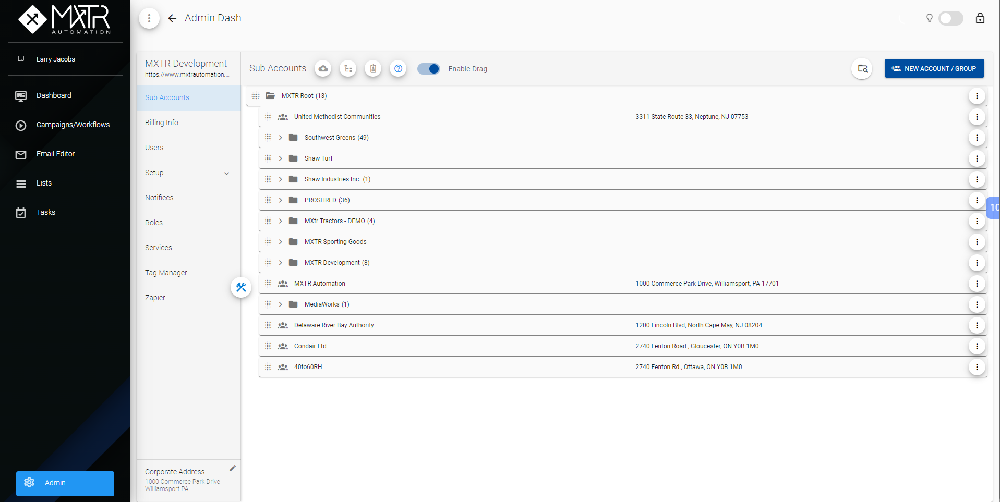

# {{ $page.title }}

Admin Dash is another Dashboard for only Admin Users to manage Sub Accounts, Users, Roles, Services, Tags and so on.

There are several sections in this dashboard and admin can do specific updates in these sections.

Admin Dash page can look like this:

## Admin Dash Sections
On the image above, you can see these sections on the left side of admin dash page. We can select each section to see its page. Below are sections in this Admin Dash.
- **Sub Accounts**
- **Billing Info**
- **Users**
- **Setup**
- **Notifiees**
- **Roles**
- **Services**
- **Tag Manager**
- **Zapier**

> Simple main functionalities are add, update and delete.
> You can see the functionalities for each section more details.