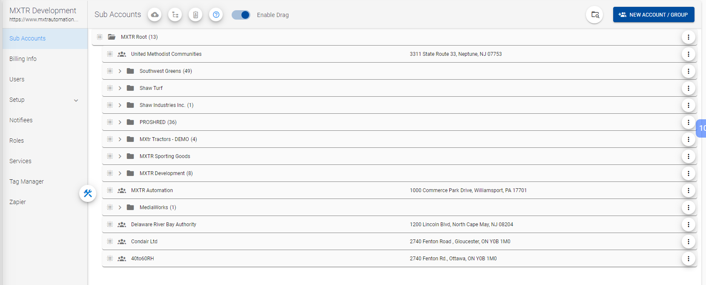
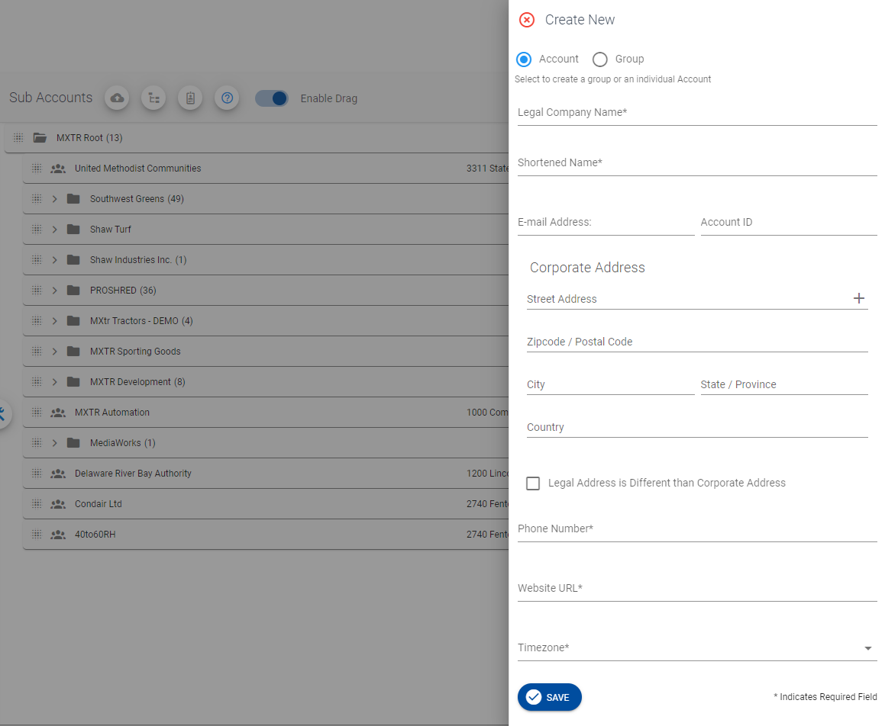
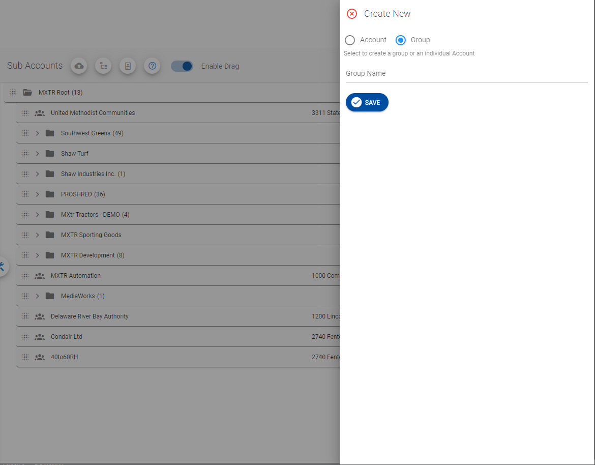
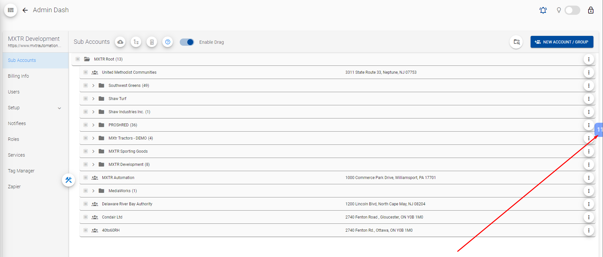
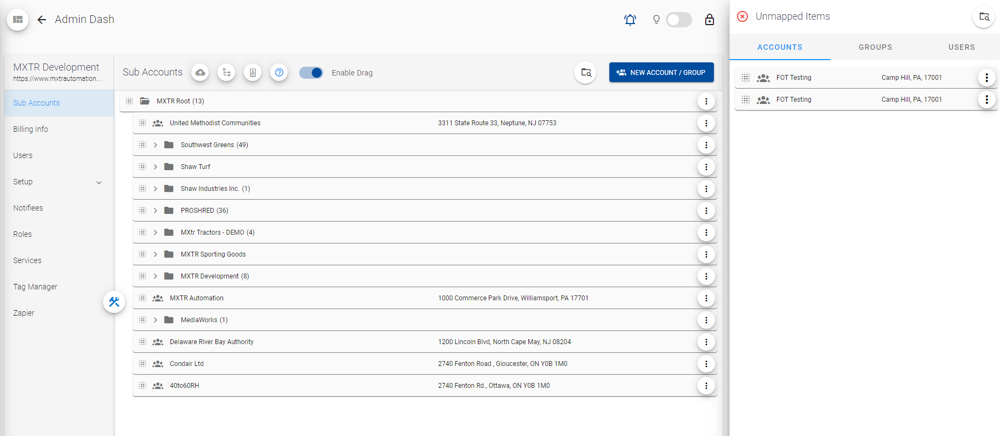
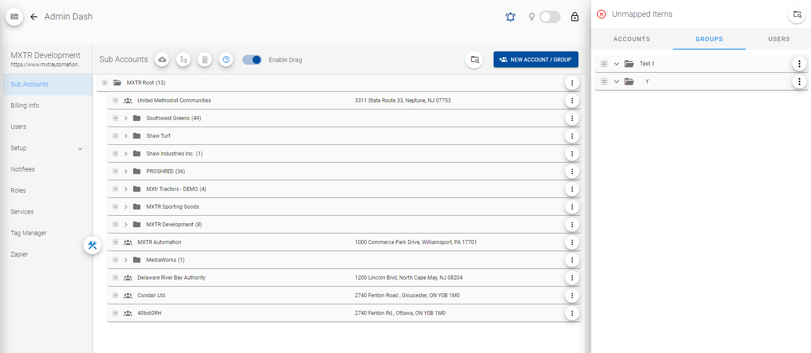

# {{ $page.title }}

You can click "Sub Accounts" tab, when trying to manage Sub Accounts.



> As you see above image, there are several buttons and checkbox in this page.
> You can see all these functionalities below.

Everything starts from `SubAccounts.vue` (`src/views/admin/pages/subAccounts/SubAccounts.vue`) component.
When creating Unmapped Account/Group, these will be AT THE LEVEL CURRENTLY DRILLED INTO IN SUBACCOUNTS.

## NEW ACCOUNT / GROUP
You can see this  button on the top-right and you can click this to add account or group.

```vue
...
    <v-btn
        color="button"
        :disabled="isTutorial"
        :dark="!isTutorial"
        @click="openNavDrawer('new_account')"
    >
      <v-icon left>mdi-account-multiple-plus</v-icon>
      New Account / Group
    </v-btn>
...
```

You can see create new account or group form like below:


> New Account Form (You can select by clicking Account Radio button.)
```vue
...
    <v-col v-else-if="accountGroupRadio === 0">
        <account-form :mode="mode" @account-saved="formSaved" />
    </v-col>
...
```


> New Group Form (You can select by clicking Group Radio button.)
```vue
...
    <v-col v-if="accountGroupRadio === 1">
        <v-text-field
            v-model="groupName"
            label="Group Name"
            clearable
        />
        <v-btn
            v-if="isEditGroup"
            rounded
            :loading="saveGroupLoading"
            color="button"
            @click="saveEditGroup"
        >
          <v-icon left>mdi-check-circle</v-icon>
          Save Changes
        </v-btn>
        <v-btn
            v-else
            color="button"
            rounded
            :loading="saveGroupLoading"
            @click="saveGroup"
        >
          <v-icon left>mdi-check-circle</v-icon>
          Save
        </v-btn>
    </v-col>
...
```

`<account-form>` is a component to complete account information and this accepts `:mode` and `:@account-saved` attributes.
`:mode` is for managing `Create` or `Edit` and `@account-saved` is function to be called after account is saved successfully.
```javascript
...
    formSaved(value) {
        // this.refreshUnmapped('accounts');
        let swalInfo;
        let defaults = {
            confirmButtonText: "Got it!",
            toast: true,
            position: "top",
            timer: 10000,
        };
        if (value.mode === "invalid") {
            swalInfo = {
                type: "error",
                title: "Something Went Wrong!",
                text: "Please ensure that all required fields have a value.",
                ...defaults,
            };
        } else if (value.mode === "edit") {
            if (value.success) {
                swalInfo = {
                    type: "success",
                    title: "Success!",
                    text: "Your changes have been saved successfully!",
                    ...defaults,
                };
                this.$refs.navDrawer.drawerToggle();
                this.accountDrawer = false;
            } else {
                swalInfo = {
                    type: "error",
                    title: "Something Went Wrong!",
                    text: "Please verify all information and try again",
                    ...defaults,
                };
            }
        } else if (value.mode === "add") {
            if (value.success) {
                swalInfo = {
                    type: "success",
                    title: "Success!",
                    text:
                        "Succesfully Added: " +
                        value.accountName +
                        " to Unmapped Accounts",
                    ...defaults,
                };
                this.accountDrawer = false;
                this.$refs.navDrawer.drawerToggle(false);
                this.getUnmappedAccounts();
            } else {
                swalInfo = {
                    type: "error",
                    title: "Something went wrong!",
                    text: "Could not add: " + value.accountName,
                    ...defaults,
                };
            }
        }
        this.$swal(swalInfo);
    }
...
```

When we create account or group here, these are unmapped account or group.

### 1. Create Account
   This action is done in `AccountForm.vue` (`src/views/admin/pages/subAccounts/components/AccountForm.vue`) component.
   ```javascript
   ...
        case "addAccount":
            let newFormValue = AccountHelper.ConvertTenantToUnmapped(
              this.formValue,
              this.getDashCurrentDealer.tenant_id
            );
            this.addUnmappedAccount(newFormValue);
            break;
   ...
   ```
   This `formValue` is the account form value and `ConvertTenantToUnmapped` converts this `formValue` to `UnmappedTenant` object.
   > `AccountHelper.ts` (`src/helpers/admin/AccountHelper.ts`)

   > Sets tenant's `mxtr_unmapped_tenant_id` property as `undefined` and `root_tenant_id` property as `this.getDashCurrentDealer.tenant_id` (Dashboard Current Dealer's Tenant_id).

   > When we select tenant in SubAccounts Page Table, it changes dashDealer (`getDashCurrentDealer`).

   `addUnmappedAccount` is a function to save this `UnmappedTenant` to server.

### 2. Create Group
   This action is done in `SubAccounts.vue` (`src/views/admin/pages/subAccounts/SubAccounts.vue`) component.
   ```javascript
   ...
        async saveGroup() {
            if (this.groupName && this.groupName.length) {
                this.saveGroupLoading = true;
                let rootTid = 
                    this.currentDealer.tenant_parent_id === Constants.ROOT_TENANT_ID
                    ? this.currentDealer.tenant_id
                    : this.currentDealer.tenant_parent_id;
                let modifyObj = new Modify(rootTid, ModifyType.add, "group");
                let requestObj = new AddGroupRequest(rootTid, this.groupName);
                modifyObj.Add = [requestObj];
                let addResponse = await AdminHelper.ModifyUnmapped(modifyObj);
                if (addResponse.results) {
                    this.cleanUnmappedGroups(addResponse.results);
                    this.$swal({
                       title: "Success!", 
                       text: `Successfully Added ${addResponse.results[0].name}`, 
                       confirmButtonText: "Sweet!",
                       position: "top",
                       type: "success",
                       timer: 5000,
                       toast: true,
                    });
                    
                    this.$refs.navDrawer.drawerToggle(false);
                    this.saveGroupLoading = false;
                    this.refreshUnmapped("group");
                    this.pulseUnmapped = true;
                }
            } else {
                this.$swal({
                   title: "Error!",
                   text: "You must enter a Group name to continue...",
                   confirmButtonText: "Got it!",
                   position: "top",
                   type: "error",
                   timer: 5000,
                   toast: true,
                });
            }
         },
   ...
   ```
   This function generates `Modify` object with `rootTid` value and user inputed `groupName` value.
   > Sets `rootTid` value to `Modify` object's `RootTid` property.

   `ModifyUnmapped` saves this `Modify` object to server as `UnmappedGroup`.

### 3. Additional
   First, let's focus on `root_tenant_id` and `getDashCurrentDealer` more details.

   Below are setter and getter for `dashCurrentDealer` in `dashboard.js` (`src/store/modules/dashboard.js`).    

   ```javascript
   ...
        getDashCurrentDealer: (state) => state.dashCurrentDealer,
   ...
   
   ...
        setDashCurrentDealer: (state, dealer) => { state.dashCurrentDealer = dealer; }
   ...
   ```

   This `dashCurrentDealer` value is managed with below code in `SubAccounts` component.
   ```javascript
   ...
        currentDealer: {
            get() {
                return this.getDashCurrentDealer;
            },
            set(value) {
                this.$store.commit("setDashCurrentDealer", value);
            },
        },
   ...
   ```
   
   Sub Accounts Table is `NestedDrag.vue` (`src/views/admin/pages/subAccounts/components/NestedDrag.vue`) component.
   When selecting tenant in Sub Accounts Table, `dashCurrentDealer` are changed with calling `SubAccounts` component's `assignRootNode` function in `NestedDrag` component's `setNode` function.
   ```vue
   ...
      <v-btn small text class="mx-n1 px-2 text-capitalize" style="font-size: 12px" @click="onSelected(el)">
          {{ el.data.tenant_name ? el.data.tenant_name : el.data.name }}
          <span class="ml-1" v-show="el.children.length">({{ el.children.length }})</span>
      </v-btn>
   ...
   ```

   ```javascript
   ...
       onSelected(node) {
            if ((node.data.tenant_type_id === 2 || node.data.tenant_type_id === 1) && !node.data.isUnmapped) {
                this.setRootNode(node);
            }
        },
   ...
   ```
   As mentioned above, this `dashCurrentDealer` is used as `root_tenant_id` when creating `UnmappedTenant` object.
   ```javascript
   ...
       public static ConvertTenantToUnmapped(tenant: Tenant, root_tid: string, isEdit?: boolean): UnmappedTenant {
           ...
           unmapped.root_tenant_id = root_tid;
           return unmapped;
           ...
       }
   ...
   ```
   This `root_tenant_id` is saved and used as property of Unmapped Account / Group object in server.

## View Created Accounts / Groups
You can see created accounts and groups by clicking the button like below:

> Unmapped Accounts List

> Unmapped Group List

> When selecting tenant in Sub Accounts Table, you see that tenant's unmapped accounts and groups.

