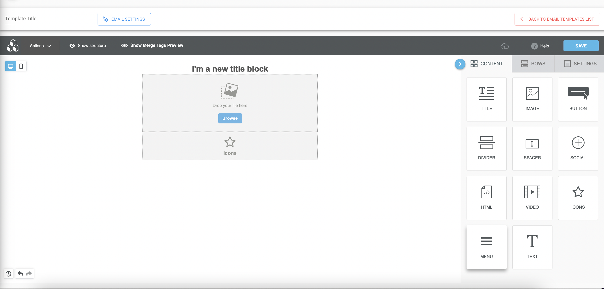
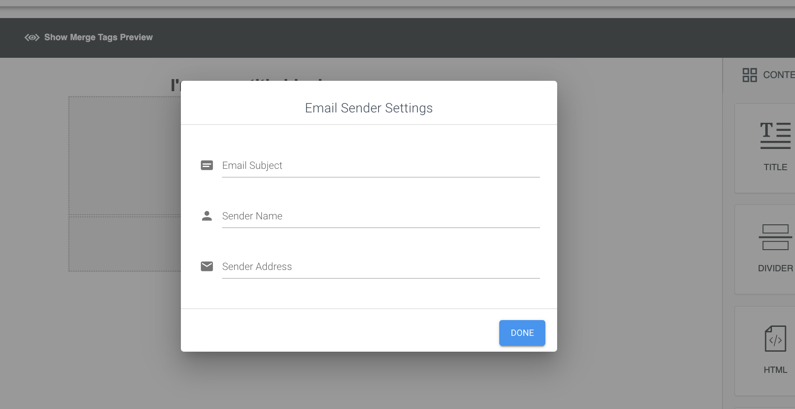
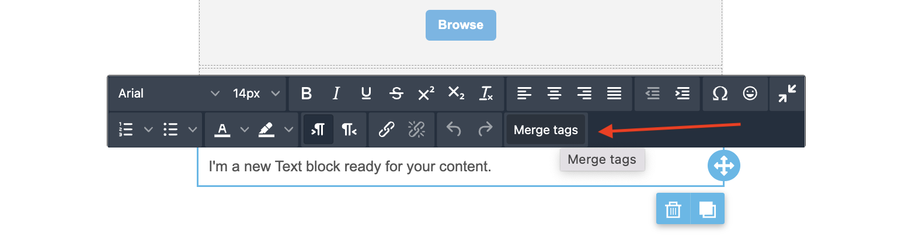
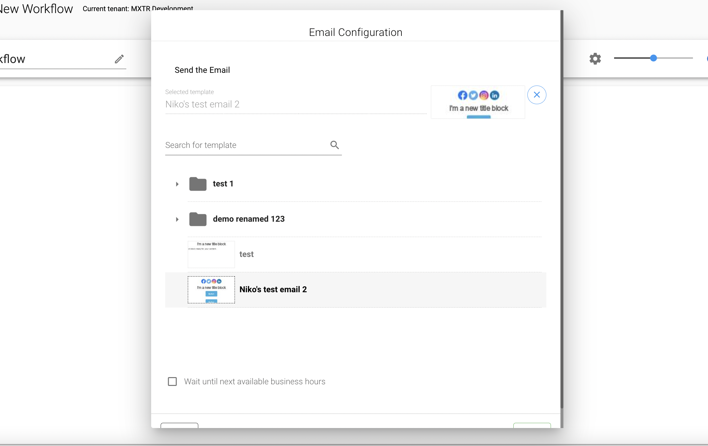

# {{ $page.title }}

Email Editor functionality allows you to create and update "Email Templates", these templates then can be used in your
[Workflows](../workflows). Templates and Workflows allows us to automate process of preparing and sending Messages or 
Notifications to the Leads, so the context of any Email template is Lead.

## Functionality
The functionality of the Email Editor is similar to "standard" Email editors available online, you can add/edit/delete
some controls, text blocks, titles, html etc.

On the top of the screenshot you can see text field which sets "Title" for your template and "Email Settings" button, if
you press this button you open next window:

Here you can see settings of the "Email Sender", as you may know this message sends via our system and there is no single
"Sender" for all the Emails. You need to set your "Sender" for concrete Email Template, so target Lead will understand
Who send this Email.

Another important thing in our templates is "Merge variable" or "Merge tags" in "Email Template understanding they are
just "placeholders" for Lead data (Lead Fields). These "tags" available in text blocks and only after your template save.

If you click on it, you will see the list of available "Variables" that you can use in this place.

## Technical
The "Email Editor" page available via `/editor/:templateId` route for edit existing templates or via 
`/editor/new/:folderId` to create new one. In first route `templateId` is id of editing template and `folderId` in 
second is id of the folder that you want to put new template in.

As a base for our Template we use [Bee Editor plugin](https://www.npmjs.com/package/@mailupinc/bee-plugin).

Components hierarchy for Editor looks like this:
1. `EmailEditor.vue` (src/views/emailEditor/EmailEditor.vue) - this is our "Page Component" that is used in router 
calls, here we add modal for "Email Settings" and add "Top Toolbar"
2. `BeeEmailEditor.vue` (src/components/core/BeeEmailEditor.vue) - we import and call this "Core component" inside 
`EmailEditor.vue`, here we create container for "Bee Editor" and add another modal for "Sending Test Email"
3. `beeEmailEditor.js` (src/mixins/beeEmailEditor.js) - mixin that is used in `BeeEmailEditor.vue`, here we import
[Bee Editor plugin](https://www.npmjs.com/package/@mailupinc/bee-plugin) and setting it up.

## Email Editor in modal
When you create or edit  Workflows and trying to add or edit [Send Email Activity](../workflows/sections.md#sendemailactivity) 
or [Send Notification Email Activity](../workflows/sections.md#sendnotificationemailactivity) you are able to open
selected "Email template" to review or edit it if needed.

By press on template preview you will open `EmailEditorModal.vue` component (src/views/emailEditor/EmailEditorModal.vue).
The code of this component is pretty simple, there we just call `EmailEditor.vue` 
(src/views/emailEditor/EmailEditor.vue) and add modal window logic (close and open operations). Visually it is the same 
"Email Editor page" just wrapped in modal.

So this mode (modal mode) exist to allow users make fixes and view their templates from Workflow page without loosing
their progress in Workflow building. 