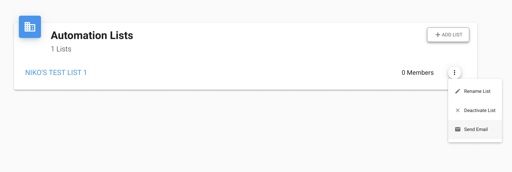
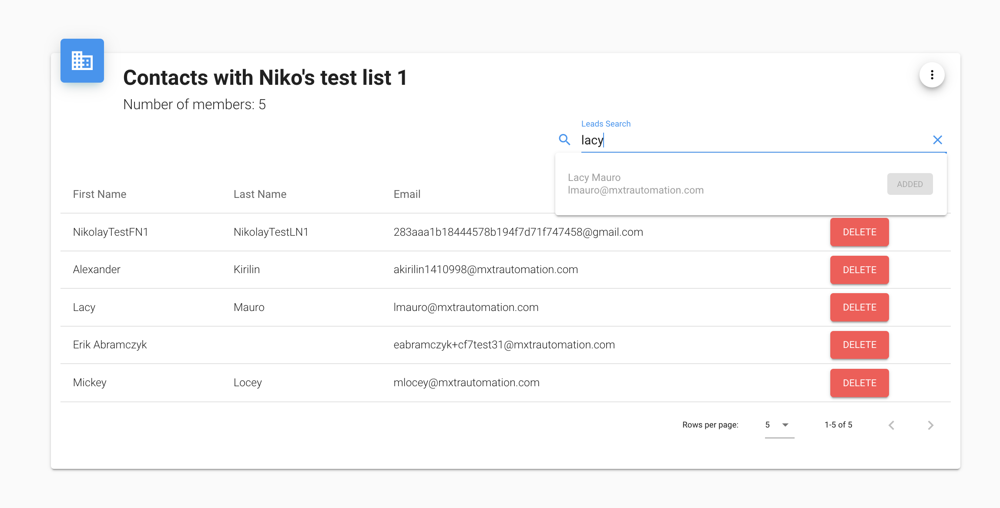
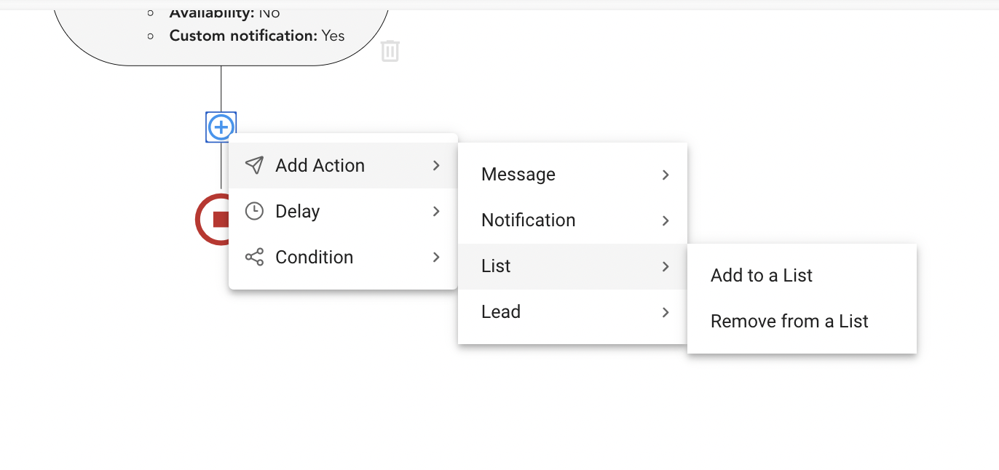
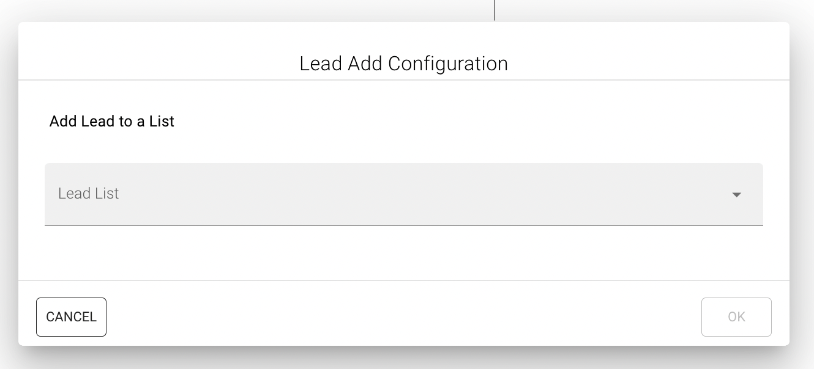

# {{ $page.title }}
The "Lead Lists" are groups of the leads created via admins of our platform. The members of this "groups" or "lists" are 
from number of "Leads" that available for current "Tenant".

Functionality for Lead list are available via `/lists` route, here you can add, delete, rename and even send Email to
Lead list.

There are two ways to edit members of the "Lead list", ["Manual"](#edit-lead-list-manually) and 
["Automated"](#edit-lead-list-automatically)

## Edit Lead List manually
To edit Lead lists manually you just need to click on some item from the screenshot above, and you will be navigated to
`/lists/:id` route, where `id` is id of the selected Lead List.

On this page you can see all the members of this list. Using the searchbar on the right you can find Leads and add them.

## Edit Lead List automatically
To automate process of add/remove leads for concrete List you will need to create corresponding 
[Activities](/workflows/sections.md) in your workflows. In [Section Menu](../workflows/sectionMenu.md) for "Lead list" 
actions we have next items:

As you can see there are two options available "Add to List" and "Remove from a List", by selecting one of them you will
open [Section Modal](../workflows/sectionModals.md) that allows you to create corresponding 
[Activity](/workflows/sections.md) where you can select target List:

## Components
All the components for Lead list functionality are laying in `src/views/leadLists` directory, they did not contain any
specific logic, and they are just usual vue components.