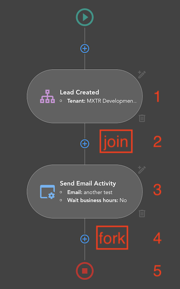

# {{ $page.title }}

Connection is entity which connects two neighbour [Activities](./sections.md). Usually connection connects 
[Fork](./sections.md#fork) or [Join](./sections.md#join) (activities that do not have visual part) with any other
Activity (with visual part) or wise versa. But there is no case when we need to connect Join and Fork or Fork and Join. There is also no
case when we need to connect Activity with other Activity, usually there is Join or Fork between them.

## Connection entity
Connection entity must contain 3 properties:
- **sourceActivityId** - source (parent) activity id
- **destinationActivityId** - destination (child) activity id
- **outcome** - branch id

With first and second properties everything is pretty clear, but what is "outcome"?

## outcome
`outcome` accepts two values: id (string) of the branch or null. When activity have a single child the `outcome` property
should be `null` but if there are few child Sections then connections to these Sections must contain unique branch id.

## Examples


On the schema above we have 4 sections, 
- Start - `start`
- Lead Created Trigger - `trigger`
- Send Email Activity - `activity`
- Finish section - `finish`

If you check `activities` state in vuex you will notify that it contains 5 items, when `sections` state contains 4, and
we have 4 items for `connections` state.
Looks a bit confusing, but let's explain everything step by step:

First of all `sections` state contains only Activities that you see on the screenshot above (activities that have visual
part), when `activities` state must contain  all activities that would be saved on the backend side. It means that 
`activities` state does not contain `start` section, but why 5 items there? The thing is that we have two more activities
in our workflow, that are not have visual part, but they still must be saved on the backend side, they are `Join` and `Fork`.

Each workflow starts from Triggers, there can be a single trigger or number of them, but important moment that for both
cases we insert [Join](./sections.md#join) activity after these triggers, as here we can have deal with "multiple 
connections".

[Fork](./sections.md#fork) activity appears between `activity` and `finish`, as we should pass "Fork" activity after 
each section that can have more than one child (more the one branch) in the future.

Visually we can "insert" our "invisible" activities onto next places:



So now we know what items we have in `activities` state, let's check `connection` for them.

So to connect two activities we have to know their ids, lets say that activity id corresponds to activity number from
schema above. First connection then should connect `trigger` and `join`:
```javascript
const triggerJoinConnection = {
    sourceActivityId: 1,
    destinationActivityId: 2,
    outcome: null,
}
```

`join` to `activity` and `activity` to `fork` connections would look like:
```javascript
const joinActivityConnection = {
    sourceActivityId: 2,
    destinationActivityId: 3,
    outcome: null,
}

const activityForkConnection = {
    sourceActivityId: 3,
    destinationActivityId: 4,
    outcome: null,
}
```

As you can see the rules is pretty simple for reviewed connections, but for the `fork` to "some section" the connections
process is a bit complicated. The thing is that for connections "from Fork" we need to provide `outcome` property as
exactly "Fork" activity allows us to have multiple connections to single activity. In our case we do not have multiple 
connections after our `activity`, but we still have to insert `Fork` after it.

So [Fork](./sections.md#fork) must contain information about its branches - which is `Branches` property inside `state`
property, in reality it is simple array of the "Fork branches ids" (these ids generates when user adds new child for `activity` 
above its fork). Or in other words: once the child section is created we need to create new branch (add new id into 
`Branches` property) and new connection with this branch in `outcome`. 

In our case lets say we generate new branch with `id: "b1"`, then connection will look like this: 

```javascript
const forkFinishConnection = {
    sourceActivityId: 4,
    destinationActivityId: 5,
    outcome: "b1",
}
```

## Create connection process
Practically new connection creates each time we create new section. Let's review the process of connection generation
from the moment when user fill all the required fields in [Section modal](./sectionModals.md) and press "Save" button.

So once user saves "Section modal" the `submitCurrentModal` method of the `workflow.js` mixin triggers 
(`src/mixins/workflow/workflow.js`)

```javascript
    ...
        async submitCurrentModal({ template }) {
            let activityTemplate = null
            if(this.sectionEdit) {
                this.$store.commit('updateActivity', template)
                this.handleModalClose()
            } else {
                activityTemplate = this.prepareSection(template, this.activeSection)
                this.createActivity(activityTemplate) // we are intersted in this call
            }
            ...
        },
    ...
```
We are interested in `createActivity` call as exactly inside this method of `section.js` mixin 
(`src/mixins/workflow/section.js`) we create new connections for activities.
There are lots of code lines in this method, it contains main logic for new activities, forks, joins, fork branches and
connections generation. This method is also good enough commented, so you can just read the comments and understand the
logic. Inside this method you can find few calls for `createActivity`, usually it calls when activities that needs to be
connected are already created as we need their ids for connection.

The method is `createConnection` and it is pretty simple, it returns object which we are already familiar with:
```javascript
...
    createConnection(source, destination, branch = null) {
        return {
            sourceActivityId: source,
            destinationActivityId: destination,
            outcome: branch,
        }
    },
...
```

Summarising all of that the flow for the new activity creation will look like:
- press "save" button on the Section modal
- trigger `submitCurrentModal` method form `workflow.js` mixin
- call `createSection` method from `section.js` mixin
- call `createConnection` method from `section.js` mixin, which returns connection
- add new connection to the `connections` state
