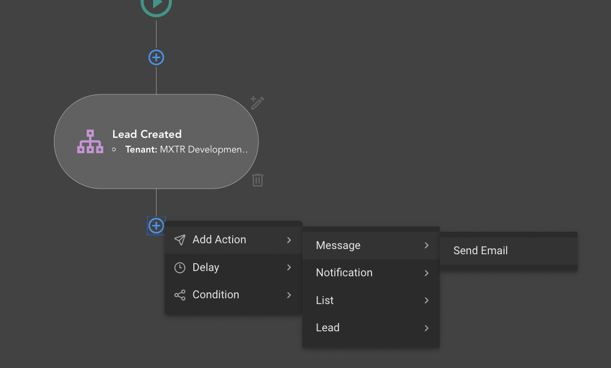
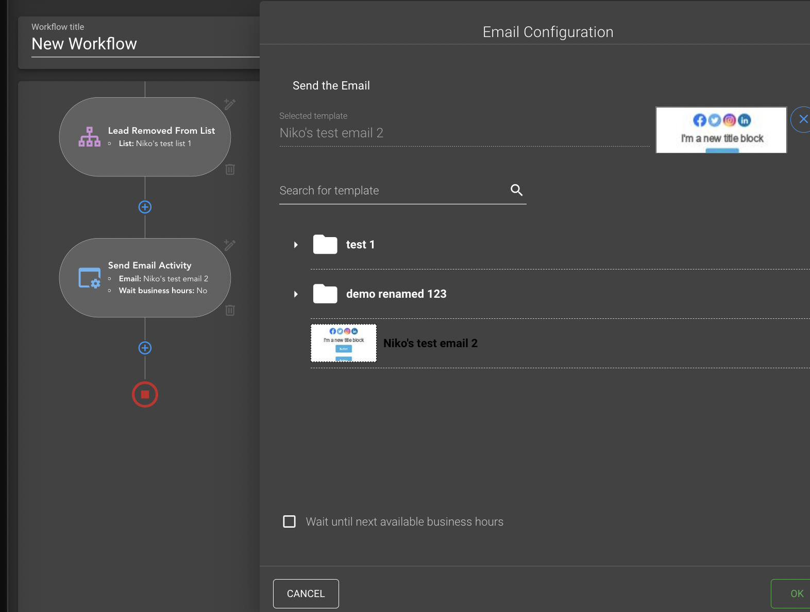

# {{ $page.title }}

Workflows (or Campaigns) is an important part of the core-user-dash project. Its functionality allows the users
(tenants) create some kind of schemas which then could be executed.

Workflow allows the users to automate some processes and actions under own leads (clients or contacts). The simplest 
workflow can look like this:


## Workflow Sections (Activities)
On the image above you can see typical example of the workflow which contains 4 items - **Activities**. First and last -
are automatically generated sections, next statements are valid for them:
- Workflow always starts from **Start Section** 
- Each workflow branch (current workflow has only one branch) must be ended with **Finish Section**

Second one is a trigger section or just **Trigger** - this type of sections usually begins the workflow, we can say
that "Any workflow starts its execution form Trigger". The Workflow can have multiple triggers at the beginning, which
means that list of the actions which laying under triggers can be executed multiple times depending on trigger event:


Third section is an action section or just **Action**. Actions can do some work for your leads, for example "Send an
Email" or "Change Lead Status" and many other things. Usually Actions on the Workflows  stands vertically when Triggers
mostly horizontally.

We've just seen 4 of the 8 section roles: 
- Start
- Finish
- Trigger
- Action

Check the full list of sections and their roles: [Workflow sections](/workflows/sections)

## Connections
Second important entity in workflow is a **Connection**. Connection matches two neighbour Activities visually you can 
see them as lines between sections, but technically they are more complicated.
If we are talking about huge workflow schemas with lots of branches or with multiple triggers in it, then we must use
special "transitional" actions - [Join](workflow/sections#Join) and [Fork](workflow/sections#Fork), they allow us to 
connect multiple sections to a single and vice versa single section to multiple.
See detailed description of the [Connections](/workflows/connections)

## Technical side of the workflow
We already know that two important entities of any workflow are [Connection](/workflows/connections) and
[Activity](/workflows/sections) but how it is working under the hood? Technically Connection and Activity are simple
JS objects with number of properties.
Connection object always has defined properties: 
```javascript
const connection = {
    sourceActivityId: String, // id of "from" activity (uuid)
    destinationActivityId: String, // id of "to" activity (uuid)
    outcome: String, // id of the branch (uuid, and null if a single branch)
}
```
As you can see connection is pretty simple object and displays destination and source activities information.

Activity has a different structure and must contain all the information that needed for correct rendering of the section
and making connections "from" and "to" its section.
```javascript
const activity = {
    id: String, // uuidv
    type: String, // activity name from the "constants/canvas/activities",
    state: { // contains all the information for specific activity that must be saved on the back-end side
        name: String,
        role: String, // activity role form the "constants/canvas/sectionRoles"
        // ...
    },
    items: { // contains visual parts of the section that must be rendered on the UI (not sends to the back-end)
        primaryBtn: Object,
        nextSectionStrokeLeft: Object,
        // ...
    },
}
```

So as you may understand workflows is a number of activities and connections between them, so the Backend expects these
two arrays from us. There are also few layers on the UI that are doing some preparations before we see new sections in 
our UI. Check more detailed description of the [Workflow technical side](/workflows/technical)

## Creating a new Section
By clicking  button you will open
[Section Menu](/workflows/sectionMenu), this menu shows you the list of available sections at the current step. For
example after "Trigger" usually stands "Action" and the Section Menu will look like this:



## Section Modal
If you try to select some Activity form the section menu the [Section Modal](/workflows/sectionModals) would be opened.
Each Activity has its own section modal, all the modals laying in `src/views/workflow/sections` directory, they are
split by section roles.

The modals for any Section has similar structure, it is a Form with number of inputs. For example "Send Email
Activity" modal:



## Workflow Save and Activate
The workflow can be saved in two variants: **Active** and **Inactive**.
Use next buttons in the navbar on the top of the page for workflows state manipulation:


When workflow is activated it means that your workflow starts executing which in turn means that all the start triggers
in your workflows starts waiting for their events (for example new lead appear in the system), and if the event occurs
then other parts of workflows starts their work.

Otherwise, inactive workflows would never fire any Activity till you activate it.

> In case if your Workflow is already active you are still able to edit it, but you have to understand that, if
> your workflow has already been started its execution for some users or leads, you will not see your changes in 
> execution results for them, you will be able to use your edits only for new executions.


