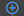

# {{ $page.title }}

Workflows (or Campaigns) is an important part of the core-user-dash project. Its functionality allows the users
(tenants) create some kind of schemas which then could be executed.

Workflow allows the users to automate some processes and actions under own leads (clients or contacts). The simplest 
workflow can look like this:

## Workflow Sections (Activities)
On the image above you can see typical example of the workflow which contains 4 items - **Activities**. First and last -
are automatically generated sections, next statements are valid for them:
- Workflow always starts from **Start Section** 
- Each workflow branch (current workflow has only one branch) must be ended with **Finish Section**

Second one is a trigger section or just **Trigger** - this type of sections usually begins the workflow, we can say
that "Any workflow starts its execution form Trigger". The Workflow can have multiple triggers at the beginning, which
means that list of the actions which laying under triggers can be executed multiple times depending on trigger event:

Third section is an action section or just **Action**. Actions can do some work for your leads, for example "Send an
Email" or "Change Lead Status" and many other things. Usually Actions on the Workflows  stands vertically when Triggers
mostly horizontally.

We've just seen 4 of the 8 section roles: 
- Start
- Finish
- Trigger
- Action

Check the full list of sections and their roles: [Workflow sections](/workflows/sections)

## Creating a new Section
By clicking  button you will open
[Section Menu](/workflows/sectionMenu), this menu shows you the list of available sections at the current step. For
example after "Trigger" usually stands "Action" and the Section Menu will look like this:

## Section Modal
If you try to select some Activity form the section menu the [Section Modal](/workflows/sectionModals) would be opened.
Each Activity has its own section modal, all the modals laying in `src/views/workflow/sections` directory, they are
split by section roles.

The modals for any Section has similar structure, it is a Form with number of inputs. For example "Send Email
Activity" modal:

## Workflow Save and Activate
The workflow can be saved in two variants: **Active** and **Inactive**.
Use next buttons in the navbar on the top of the page for workflows state manipulation:

When workflow is activated it means that your workflow starts executing which in turn means that all the start triggers
in your workflows starts waiting for their events (for example new lead appear in the system), and if the event occurs
then other parts of workflows starts their work.

Otherwise, inactive workflows would never fire any Activity till you activate it.

> In case if your Workflow is already active you are still able to edit it, but you have to understand that, if
> your workflow has already been started its execution for some users or leads, you will not see your changes in 
> execution results, you will be able to use your edits only for new executions.

