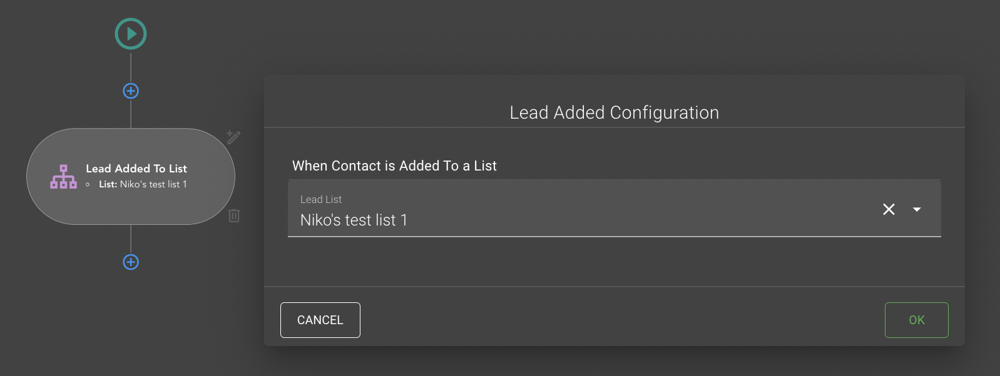

# {{ $page.title }}
Each workflow section has its own "modal", except sections without visual part ([Join](#join) and  [Fork](#fork)) and 
automatically generated sections ([Start](#start), [Finish](#finish)). For example lets look onto 
[LeadAddedToListTrigger](#leadaddedtolisttrigger), it has next modal:



Usually modal contains section name and form controls that allows you to set up this section.
As we said previously sections has its modals, so all these modals has own components they are split by role in separate
folders, all of them you can find in `views/workflow/sections` directory.
 
Modal can be opened in two modes: ["edit"](#edit-mode) and ["create"](#create-mode) section, as you can see using modal
we can set [activities data](./sections.md#activity-entity) that can be saved into backend when user press "Save" button.

## Create mode
By press  button (after section) you will open 
[Section Menu](./sectionMenu), this menu displays dynamic list of available sections that can be added 
after previous one.


In "create section mode" all the field in the form would be empty or filled with default values.

## Edit mode
To open modal in "edit mode" you need to press  button next to existing 
section. You will open the same component as for ["create"](#create-mode) mode, with only difference: all fields would
contain previously added data.

## Modal component
As we mentioned above all the modal component laying in `views/workflow/sections` directory. Let's look on the typical
example of the component to understand how it is working, the modal for [LeadAddedToListTrigger](#leadaddedtolisttrigger)

```vue
<script>
import {mapGetters} from "vuex"
import {activityTypes} from "@/constants/canvas/activities"
import {sectionRoles} from "@/constants/canvas/sectionRoles"
import {sectionModal} from "@/mixins/workflow/sectionModal"

export default {
  name: "LeadAddedToListTrigger",
  mixins: [sectionModal],
  computed: {
    ...mapGetters([
      'leadLists',
    ]),
  },
  data: () => ({
    selectedLeadList: null,
    leadListsLoading: false,
  }),
  methods: {
    handleClick() {
      this.$emit('submit', {
        template: {
          type: activityTypes.LeadAddedToListTrigger,
          state: {
            role: sectionRoles.trigger,
            displayName: 'Lead Added To List',
            LeadListId: this.selectedLeadList.id,
            name: this.selectedLeadList.name,
            list: [
              {
                name: 'List',
                value: this.selectedLeadList.name
              }
            ],
          }
        }
      })
    },
    required(value) {
      if (!value) return 'Required field'
      return true
    },
  },
  mounted() {
    if (this.sectionEdit) {
      const { LeadListId, name } = this.sectionEdit.state

      this.selectedLeadList = {
        id: LeadListId,
        name,
      }
    }

    this.leadListsLoading = true
    this.$store.dispatch('getLeadLists').then(() => {
      this.leadListsLoading = false
    })
  },
}
</script>
```
As you can see from the `mounted` hook code, switching between "edit" and "create" modes depends on `'sectionEdit'` vuex
state, we can say that we are in "edit" mode when `'sectionEdit'` vuex state has some data.
So we can make a conclusion that press on ["Create section button"](#create-mode) just opens modal, when press
["Edit section button"](#create-mode) must also fill the `'sectionEdit'` state with corresponding section data. Below
we will study where and how it happens.

One more important thing here is `handleClick` method. Each modal implements this method, as you can see there we emmit
`'submit'` event and add as a second parameter object with data.
This object must contain `template` property with all the data for [activities data](./sections.md#activity-entity). 
So as you may understand all we need form this component is to collect data from user inputs and post this data by
trigger `'submit'` event. Below we will see where we sign on this `'submit'` event, to understand the flow of 
[Modal rendering](#modal-rendering-process)

## Modal rendering process
Firstly lets see where we call all these "Section modals" components. Imports for these components are added in only one
place: `Workflow.vue` (`views/workflows` directory). But in the template you do not find any usage of it, because here
we are having a deal with "dynamic" components.

Listening for clicks on Sections buttons you can find in the next code:
```vue
  ...
            <SectionsGrid
                v-if="getSections.length"
                :movement="movement"
                @start="handleStart"
                @email="openBeeEmailEditor"
                @add="onAddSection"
                @edit="editSection($event)"
                @finish="saveWorkflow"
                @remove="initRemoveSection"/>
  ...
```

What `SectionsGrid` is responds for you can understand reading, [Activity draw process](./sections.md#activity-draw-process)
For now it is enough to know that this component responds for Sections rendering. Let's look on this line from code above 
`@edit="editSection($event)"` here we sign to "edit" event (press on edit button next to section) with `editSection`
method. 

Let's check code of `editSection` method (`mixins/workflow/workflow.js`):
```vue
...
        editSection(payload) {
            const section = payload.value

            this.dialog = true
            this.currentModal = {
                value: section.type,
                width: '700'
            }

            this.$store.commit('setSectionEdit', section)
        },
...
```
Here we have 'setSectionEdit' commit, this is actually the place where we set the `'sectionEdit'` vuex state and our 
"Section modal" understands that we are in "Edit section mode".

Second thing here is setting `currentModal` state and its `value` prop, as you can see the value is a 
["type"](./sections.md#section-types) of the section. As you remember we have a modal for each "section type", and now 
we  can use this "section type" with "Vue Dynamic components" to render correct modal, in `Workflow.vue` template we 
have next call for dynamic component:
```vue
...
        <v-dialog
            v-model="dialog"
            :attach="findElement('workflowMainViewContainer')"
            overlay-opacity="0"
            absolute
            :width="currentModal.width"
            @click:outside="handleModalClose">
          <component
              :is="currentModal.value"
              @reset="handleWorkflowReset"
              @cancel="handleModalClose"
              @submit="submitCurrentModal"
              @remove="handleRemoveFromModal"/>
        </v-dialog>
...
```
From this line `@submit="submitCurrentModal"` we understand that this is the place where we sign to our `submit` event
from "Section modal"

This line `:is="currentModal.value"` matches selected section ["type"](./sections.md#section-types) with corresponding 
modal from imports