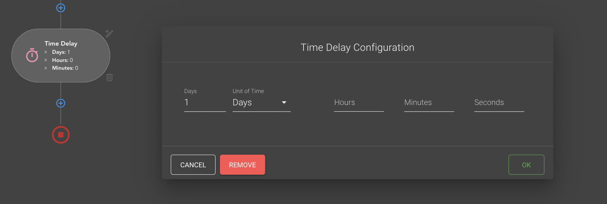

# {{ $page.title }}

Section or Activity is a "part" (step) of the workflow. Each section in the workflow plays its role, for example 
Sending an Email has an "action" role and "Lead Status changed" has a "trigger" role. But it is not the full list of 
the Sections and Their Roles.

## Activity entity
If you try to create some new section you will notice that Section item (item of workflow schema) and
[Section Modal](/workflows/sectionModals) contains the same information, to be exact Section Modal is exists to update
and add Section information.

So this Information or Data must be saved in Section Entity which usually looks like this:
```javascript
const activity = {
    id: String, // uuidv
    type: String, // activity name from the "constants/canvas/activities",
    state: { // contains all the information for specific activity that must be saved on the back-end side
        name: String,
        role: String, // activity role form the "constants/canvas/sectionRoles"
        // ...
    },
    items: { // contains visual parts of the section that must be rendered on the UI (not sends to the back-end)
        primaryBtn: Object,
        nextSectionStrokeLeft: Object,
        // ...
    },
}
```
- **id** - is an identifier of the Activity, and it is unified around all other workflow activities and even around all
  Workflows
- **type** - displays the name of the Activity, all available types you can find in the list of [section types](#section-types)
- **state** - this prop must contain all the data that was selected in [Section Modal](/workflows/sectionModals),
  moreover **state** for each activity must contain **role** property that displays [section role](#section-roles)
- **items** - is a collection of graphical items based on these items we draw schemas in our canvas. This property is
  not saves on the backend side, we build them based on Activity **type** and **role** on the UI
  (read more here: [Activity draw process](#activity-draw-process)).

## Section Roles
List of the existing Section Roles (`src/constants/canvas/sectionRoles.js`):
- **start** - Start section role
- **action** - Action sections role 
- **trigger** - Role for trigger sections
- **fork** - System role it uses for sections branching
- **join** - Another system role, uses for joining section into a single branch
- **finish** - Finish section role
- **delay** - Timer section role
- **condition** - True/False statements section role

## Section types
List of the existing Section types (Activities) (`src/constants/canvas/activities.js`):
- [Start](#start)
- [Finish](#finish)
- [Join](#join)
- [Fork](#fork)
- [EmailClickTrigger](#emailclicktrigger)
- [EmailOpenTrigger](#emailopentrigger)
- [LeadCreatedTrigger](#leadcreatedtrigger)
- [LeadMovedToTenantTrigger](#leadmovedtotenanttrigger)
- [LeadCompareFieldTrigger](#leadcomparefieldtrigger)
- [LeadStatusChangedTrigger](#leadstatuschangedtrigger)
- [LeadAddedToListTrigger](#leadaddedtolisttrigger)
- [LeadRemovedFromListTrigger](#leadremovedfromlisttrigger)
- [SendEmailActivity](#sendemailactivity)
- [SendNotificationEmailActivity](#sendnotificationemailactivity)
- [LeadAddToListActivity](#leadaddtolistactivity)
- [LeadRemoveFromListActivity](#leadremovefromlistactivity)
- [LeadChangeStatusActivity](#leadchangestatusactivity)
- [TimerEvent](#timerevent)
- [LeadCompareFieldActivity](#leadcomparefieldactivity)

We have next mapping for **Activities** and their **roles** (`src/constants/canvas/sectionRoles.js`):
```javascript
const rolesActivitiesMap = {
    [sectionRoles.start]: [activityTypes.Start],
    [sectionRoles.fork]: [activityTypes.Fork],
    [sectionRoles.join]: [activityTypes.Join],
    [sectionRoles.finish]: [activityTypes.Finish],
    [sectionRoles.delay]: [activityTypes.TimerEvent],
    [sectionRoles.action]: [
        activityTypes.SendEmailActivity,
        activityTypes.SendNotificationEmailActivity,
        activityTypes.LeadAddToListActivity,
        activityTypes.LeadRemoveFromListActivity,
        activityTypes.LeadChangeFieldValueActivity,
        activityTypes.LeadChangeStatusActivity,
    ],
    [sectionRoles.trigger]: [
        activityTypes.EmailClickTrigger,
        activityTypes.EmailVisitTrigger,
        activityTypes.EmailOpenTrigger,
        activityTypes.LeadCompareFieldTrigger,
        activityTypes.LeadOwnedByTrigger,
        activityTypes.LeadHasDateFieldTrigger,
        activityTypes.LeadStatusChangedTrigger,
        activityTypes.LeadAddedToListTrigger,
        activityTypes.LeadRemovedFromListTrigger,
        activityTypes.LeadCreatedTrigger,
        activityTypes.LeadMovedToTenantTrigger,
    ],
    [sectionRoles.condition]: [activityTypes.LeadCompareFieldActivity]
}
```

### Start
**Start** section creates automatically for each Workflow once you open "Create Workflow" or "Edit Workflow" page. This
is a first section in the workflow, but we are now saving Start section data in the Backend.


The entity of Start section has the same structure and properties for any Workflow
```javascript
const start = {
    id: "uuid", 
    type: "Start", 
    state: {
        role: "start", 
        position: "center"
    }, 
    items: {...}
}
```

### Finish
As well as [Start](#start) section, "Finish" is also generates automatically. Each "branch" in the workflow must be
ended with Finish section in other case we would not be able to save it. Finish section says: "there won't be any 
section after me". 

For example, when you create new "condition" section, [LeadCompareFieldActivity](#leadcomparefieldactivity), you will 
notice that each branch here ends with Finish section.


Entity:
```javascript
const finish = {
    id: "uuid", 
    type: "Finish", 
    state: {
        role: "finish",
    }, 
    items: {...}
}
```

### Join
Join section does not have visual Schema item, it uses as transitional activity for making multiple connections to a 
single Activity, visually you can observe it as a connection net:


The Join entity has next structure:
```javascript
const Join = {
    id: "uuid", 
    type: "Join", 
    state: {
        role: "join",
    }
}
```
Currently, Join uses only in one place of the workflow: after first triggers, to connect them to next Activity.

### Fork
As well as Join, Fork also does not have Visual Schema item, this is also transitional Activity (this activity does not
have "items" property). It allows us to make connections form single activity to multiple. When few Sections are laying 
in the same horizontal line, then we can say that these Sections are connected to the same Fork which in its turn 
connected to a single Activity (usually in the middle)


Fork Entity for the schema above will look like this:
```javascript
const fork = {
    id: "uuid", 
    type: "Fork",
    state: {
        role:"fork",
        Branches: [
            "uuid",
            "uuid",
            "uuid",
        ],
    }
}
```
Important property here is **Branches** it is an array of "Branch IDs", analysing this List we can say that our Fork
contains 3 branches, and if we look on the image above we will se 3 lines form "Send Email Activity": 2 horizontal and 1
vertical. This "Branch IDs" comes from **outcome** property of the [connection](/workflows/connections) entity.

Practically we create Fork for each Activity, even if there will be a single branch (the list of "Branches" then can
be empty), but in theory we can skip Fork creation for single branch Activities, then "connection" will have source and 
destination ids as ids of neighbour Activities.

### EmailClickTrigger
EmailClickTrigger triggers when lead clicks on some button in his email or when lead clicks on specific link, this link
must be provided in EmailClickTrigger modal. This Trigger can be used only after [SendEmailActivity](#sendemailactivity)
as EmailClickTrigger works for concrete email.


Entity:
```javascript
const emailClickTrigger = {
    type:"EmailClickTrigger",
    id: "uuid",
    state: {
        role: "trigger",
        SendEmailId: "uuid",
        emailName: String,
        Url: "url/of/the/clicked/link", // url of the link inside the email
        comparison: "exactly", // one from the "comparisonItems" const - src/constants/canvas/emailSettings.js
        frequency: 1 // // one from the "frequencyItems" const - src/constants/canvas/emailSettings.js,
    },
    items: {...},
}
```
As you may notice state prop contains all the data that user can fill in modal + **SendEmailId** - id of the email that
this trigger would work for.

### EmailOpenTrigger
This trigger is similar to [EmailClickTrigger](#emailclicktrigger) and even easier. Firstly EmailOpenTrigger triggers
when lead has opened an email.


Entity:
```javascript
const emailOpenTrigger = {
    type:"EmailOpenTrigger",
    id: "uuid",
    state: {
        role: "trigger",
        SendEmailId: "uuid",
        emailName: String,
        comparison: "exactly", // one from the "comparisonItems" const - src/constants/canvas/emailSettings.js
        frequency: 1 // // one from the "frequencyItems" const - src/constants/canvas/emailSettings.js,
    },
    items: {...},
}
```
As you can see the entity almost similar to [EmailClickTrigger](#emailclicktrigger) the only difference here **Url**
property is absent in "state".
**state**

### LeadCreatedTrigger
Another type of the triggers which is used as beginning triggers. LeadCreatedTrigger triggers on new lead creation under
current selected tenant (by default selected tenant is a tenant of your account). Inside the modal window for this
trigger we have only one field for tenant selection, but it is disabled, as now you can create LeadCreatedTrigger only
for your own tenant.


Entity:
```javascript
const leadCreatedTrigger = {
    type: "LeadCreatedTrigger",
    state: {
        role: "trigger",
        Tenant: "id", // id of the current tenant
        name: String, // name of the current tenant
    },
    items: {...},
}
```
Inside the "state" object we need to provide current tenant ID and trigger is ready to fire.

### LeadMovedToTenantTrigger
LeadMovedToTenantTrigger fires when lead changes own tenant or using other words Lead was moved to another tenant. This
trigger is also currently uses as beginning one, so we cannot see it in the middle of the workflow schema.


This trigger has only one field which is a searchbar, where you can select the target tenant, where moved lead should
appear.

Entity: 
```javascript
const leadMovedToTenantTrigger = {
    type: "LeadMovedToTenantTrigger",
    state: {
        role: "trigger",
        Tenant: "id", // id of the target tenant
        name: String, // name of the target tenant
    },
    items: {...},
}
```
Entity is similar to [LeadCreatedTrigger](#leadcreatedtrigger).

### LeadCompareFieldTrigger
This trigger is used at the beginning of the workflow schema and fires once "comparison expression" would be fulfilled.
You can compose this "comparison expression" inside LeadCompareFieldTrigger modal.


On the screenshot you can see three fields: 
- LeadField - field from database of the lead entity
- Comparator - dictates how to compare field and Value
- Value - the expected value
So we can say that this trigger will fire once any Leads "TenantId" field would be changed to any value except "123".

Entity: 
```javascript
const leadCompareFieldTrigger = {
    type: "LeadCompareFieldTrigger",
    state: {
        role: "trigger",
        FieldName: String, // name of selected field
        FieldId: "id", // id of selected field
        Comparator: "id", // comparator id form a list of comparators
        Value: String, // expected value of the selected field
    },
    items: {...},
}
```
- List of comparators comes form `/api/Activity/ComparisonTypes`
- list of Fields comes form `api/Activity/AvailableColumns`
### LeadStatusChangedTrigger
Another beginning schema trigger, which fires (or triggers) when Lead status would be changed to provided one.


Entity:
```javascript
const leadStatusChangedTrigger = {
    type: "LeadStatusChangedTrigger",
    state: {
        role: "trigger",
        name: String, // name of the expected lead status
        Status: "id", // id of the expected lead status
    },
    items: {...},
}
```
List of statuses comes from `/api/Activity/Statuses` endpoint

### LeadAddedToListTrigger
This trigger fires when Lead has been added to a specific LeadList. This lead list provides via section modal


Entity:
```javascript
const leadAddedToListTrigger = {
    type: "LeadAddedToListTrigger",
    state: {
        role: "trigger",
        LeadListId: "id", // selected LeadList id
        name: String, // selected LeadList name
    },
    items: {...},
}
```
List of Leads comes from `/api/LeadList/LeadListCollection?tenantId={tenantId}` endpoint

### LeadRemovedFromListTrigger
Trigger fires when Lead has been removed from a specific LeadList. This lead list provides via section modal. The
LeadRemovedFromListTrigger has similar view and Entity with [LeadAddedToListTrigger](#leadaddedtolisttrigger)


Entity:
```javascript
const leadRemovedFromListTrigger = {
    type: "LeadRemovedFromListTrigger",
    state: {
        role: "trigger",
        LeadListId: "id", // selected LeadList id
        name: String, // selected LeadList name
    },
    items: {...},
}
```
List of Leads comes from `/api/LeadList/LeadListCollection?tenantId={tenantId}` endpoint

### SendEmailActivity
SendEmailActivity - is an activity for sending email messages to lead from the previous step. For example in the next 
configuration the message would be sent to the Lead that was Removed From the "Niko's test list 1".
Email template can be provided inside the modal, here you can search for Templates and select it.


Entity: 
```javascript
const sendEmailActivity = {
    type: "SendEmailActivity",
    state: {
        role: "action",
        wait: Boolean, // wait for bussines hours checkbox
        thumbnail: "url", // selected Email Template thubnail url
        SendEmailId: "uuid", // unic id generated for concrete activity in the schema
        EmailTemplateId: "id", // selected Email Template Id
        name: String, // selected Email Template name
    },
    items: {...},
}
```
After this activity we have two (in future can be more) specific triggers available that works only with
"SendEmailActivity":
- [EmailClickTrigger](#emailclicktrigger)
- [EmailOpenTrigger](#emailopentrigger)

### SendNotificationEmailActivity
SendNotificationEmailActivity allows you to send email message (notification) to a specific list of recipients. The
modal allows you to select this "recipients" in a few ways:
- from the list of tenants
- provide direct email addresses
- provide and Organisation type (groups of tenants)


There is also possibility to select template ("Use custom notification" checkbox) for the email notification otherwise 
activity will use default template

Entity:
```javascript
const sendNotificationEmailActivity = {
    type: "SendNotificationEmailActivity",
    state: {
        role: "action",
        emailName: String, // name of selectd emailTemplate or null
        thumbnail: "url", // orl of selectd emailTemplate thubnail or null
        UseCustomNotification: Boolean, // disables or enables custom Email Template usage
        availability: this.availability,
        EmailTemplateId: "id", // id of selectd emailTemplate or null
        UserIds: ["id"], // list of slected tenant ids
        Emails: [String], // list of provided email adresses
        organisationTypes: ["uuid"], // list of selectd organisation types
    },
    items: {...},
}
```
- List of selectd organisation types comes from /api/Activity/OrganisationTypes?tenant={tenantId}
- List of Email Templates comes from `api/EmailTemplates/{tenantId}` endpoint

SendNotificationEmailActivity - is universal activity because it does not have specific requirements for its usage in
workflows schema, in other words you can paste it after any Activity or Trigger.

### LeadAddToListActivity
This activity allows you to automatically fill the Lead Lists. 


Only field here is Lead List

Entity:
```javascript
const LeadAddToListActivity = {
    type: "LeadAddToListActivity",
    state: {
        role: "action",
        LeadListId: "id", // id of selected lead list,
        name: String, // name of selected lead list,
    },
    items: {...},
}
```
List of Leads comes from `/api/LeadList/LeadListCollection?tenantId={tenantId}` endpoint

### LeadRemoveFromListActivity
This activity allows you to automatically remove Leads from specific Lead List.


Only field here is Lead List

Entity:
```javascript
const leadRemoveFromListActivity = {
    type: "LeadRemoveFromListActivity",
    state: {
        role: "action",
        LeadListId: "id", // id of selected lead list,
        name: String, // name of selected lead list,
    },
   items: {...},
}
```
List of Leads comes from `/api/LeadList/LeadListCollection?tenantId={tenantId}` endpoint

### LeadChangeStatusActivity
This activity can change status of the context Lead (lead form the previous step on the schema)


Entity:
```javascript
const leadChangeStatusActivity = {
    type: "LeadChangeStatusActivity",
    state: {
        role: "action",
        name: String, // selected Lead Status name,
        Status: "id", // selected Lead Status id,
    },
    items: {...},
}
```
List of statuses comes from `/api/Activity/Statuses` endpoint

### TimerEvent
TimerEvent is specific Activity not similar to others, but it is universal (you can pass it after any activity or trigger),
and it is used to create time delays before or after other activities or triggers, the only dependency this activity
requires is "time".



Entity:
```javascript
const timerEvent = {
    type: "TimerEvent",
    state: {
        role: "delay",
        TimeoutExpression: {
            Syntax: "Literal",
            Expression: "0.00:00:00",
            Type: "System.TimeSpan, System.Private.CoreLib, Version=4.0.0.0, Culture=neutral, PublicKeyToken=7cec85d7bea7798e"
        },
    },
    items: {...},
}
```
As you can see this Activity requires time in the specific format, the mask for "Expression" property is 
`days.hours:minutes:seconds`

### LeadCompareFieldActivity
LeadCompareFieldActivity has specific view not similar to any other Activity above. It exists to compare Lead Field and
its Value to fulfill "True" or "False" scenario after. In other words if the expression in inside 
LeadCompareFieldActivity modal returns True, then workflow goes by "True branch" otherwise by "False branch"


On the screenshot you can see three fields:
- LeadField - field from database of the lead entity
- Comparator - dictates how to compare field and Value
- Value - the expected value

Entity:
```javascript
const leadCompareFieldActivity = {
    type: "LeadCompareFieldActivity",
    state: {
        role: "condition",
        FieldName: String, // selected lead field name
        FieldId: "id", // selected lead field id
        Comparator: "id", // comparator id 
        Value: String, // provided comparasion value
        CaseInsensitive: Boolean, // caseInsensitive mode comparison,
    },
    items: {...},
}
```
- List of comparators comes form `/api/Activity/ComparisonTypes`
- list of Fields comes form `api/Activity/AvailableColumns`

## Activity draw process
Activity entities have an `items` property and this property contains all the visual items (objects for canvas) that
would be rendered on the UI side, but some Activities do not have visual part, as [Join](#join) and [Fork](#fork), so 
`items` prop is absent for them.

Items for typical section would look like this:
```javascript
items : {
    rectangle: { component: "Rectangle", ...},
    primaryBtn: { component: "Button", ...},
    edit: { component: "Button", parent: "6ea9f718-ae14-4558-81b7-12b813d2e33b", ...},
    initialStroke: { component: "Stroke", ...},
    ...
}
```
So here you can see the "keys": `rectangle`, `primaryBtn` ,... , these keys here does not have any technical sense, we 
provide them just to have understanding what the item is inside.
More interesting is an `component` property under that key, this prop displays the "component id" or its name, the
render function orients exactly on this property to find correct component to build the UI for it.

### Workflow rendering
Once we opened "Workflow edit" page (`views/workflows/Workflow.vue`) the `renderWorkflow()` method is called 
(`mixins/workflow/workflow.js` methods). This method doing next important things:
1. Sets canvas position to "start" - as in first screen you have to see [Start](#start) section
2. Sets correct container sizes - to have correct position calculation for new updates in canvas
3. calls `renderTemplate()` method - it is used for items (sections) building

### renderTemplate()
As you may know ([Workflow under the hood](/workflows/technical)) we do not save `.items` data in the backend, it means 
that we build all the UI items each time we get Workflow data (when open page for example).
So for us there is two reasons to call `renderTemplate()`, first when we load the page and second when we change 
something in opened workflow (add/update/delete new section).

So what is going inside `renderTemplate()` method? All we need here is to update each activity in activities list with
`items` property. In the Vuex store we have two important states:
- activities - contains the list of all activities
- sections - contains list of activities that has the visual part and each activity has `items` property with UI items.
So now it is time to say that `renderTemplate()` updates `sections` state with actual list of activities and their
visual components, and more important that this method calls each time we have changes in `activities` state.

Describing this method step by step we have next flow
1. Clear existing `sections` state
2. [Build visual part of the activity](#build-visual-part-of-the-activity)
3. Set the result to `sections`

Inside `renderTemplate()` we have a loop for `activities` state, this loop calls [prepareSection()](#preparesection) 

### prepareSection()
Method accepts next parameters: 
- template - looping activity or template of the future section
- sourceSection - parent section in the tree, which can be found using [connections](/workflows/connections)
- sections: list of already prepared sections

**prepareSection()** - method which based on its arguments should call correct "specific method" for concrete activity 
(here it is `template` argument). "Specific method" here is one of the next list : `prepareStartSection`, 
`prepareTriggerSection`, `prepareActionSection`, ..., as you may notice changes only middle part of the method name, 
this middle part is nothing else as [section role](#section-roles). 

So now we can say that we have own "prepareSection" method for each section role, and `prepareSection()` exists only for
call the correct one for us. 
If you look on any of these "prepareSection" methods you will actually notice that this is the place where "activity"
gets `items` property. Let's look on the "prepareStartSection" for example 

```javascript
    /*...*/
        prepareStartSection(sectionTemplate) {
            sectionTemplate.items.startBtn = this.createStartButton({
                sectionId: sectionTemplate.id
            })
            sectionTemplate.items.primaryBtn = this.createPrimaryBtn({
                sectionId: sectionTemplate.id,
                source: sectionTemplate.items.startBtn
            })
            sectionTemplate.items.initialStroke = this.createVerticalStroke({
                source: sectionTemplate.items.startBtn,
                destination: sectionTemplate.items.primaryBtn
            })

            return sectionTemplate
        }
    /*...*/
```
`createStartButton()`, `createPrimaryBtn()`,`createVerticalStroke()` here is other type of methods, the body of these
methods looks similar, and all of them returns to us a finite object which contains all the data that we need to draw this
item on the UI (size, coordinates, color), and more important that exactly in this place we set `component` property for
our canvas elements. You can find full list of these methods in **utils.js** mixin`mixins/workflow/utils.js`.

Summarising all the info above the flow from "call `renderWorkflow()`" to "set `component` prop" will look like this:
- renderWorkflow() - renders whole canvas container and inners
- renderTemplate() - builds `sections` from `activities`
- prepareSection() - transitional method, that calls correct "prepareSection method" for provided activity (depending on role)
- prepare***Section() - builds correct list of `items`, where *** is section role
- create*** - method that returns finite object with all data needed for canvas element, *** is the name of the item

### Section items
So we finally have our `sections` setup, each of them has `items` property with list of objects that is ready to be
rendered on the UI.

Previously we mentioned that `component` property is the most important for the `items` object, and it is true because,
based on the value of this prop we build our canvas element. If you check `views/workflow/components/`
directory, you will find a number of components, what more interesting for us that names of these components nothing
else as values for our `component` prop.
In other words "section" comprises components from this directory.

The matching magic happens in **Section.vue** component (`views/workflows/Section.vue`). We also have some composition
flow to get to this place, so lets start from the beginning.

`Workflows.vue`, point of entry, here we have another component call - `SectionsGrid.vue` important thing here is that we render
this component in the case if `sections` state is not empty, then inside "SectionsGrid.vue" running through all `sections`
and call for `Section.vue` component for each, and finally in `Section.vue` we have dynamic component call, which wrapped 
into `v-for` that loops for `section.items` and builds canvas element based on the data inside each item
```vue
    <component
        v-for="item in section.items"
        :is="item.component"
        :props="item.props"
        .../>
```
